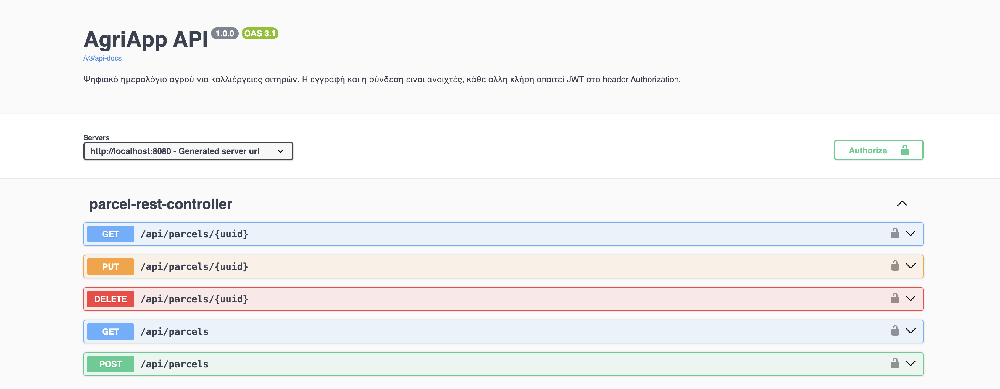
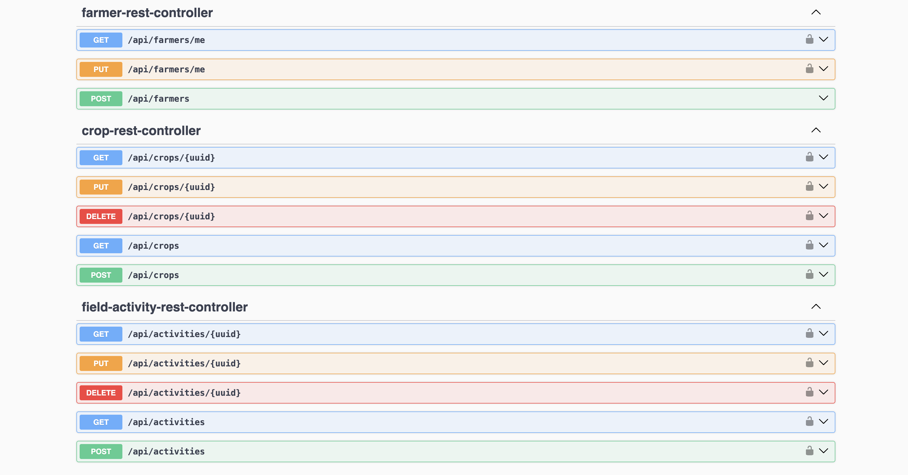
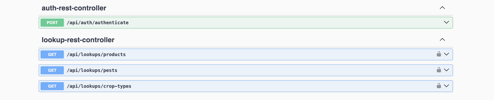
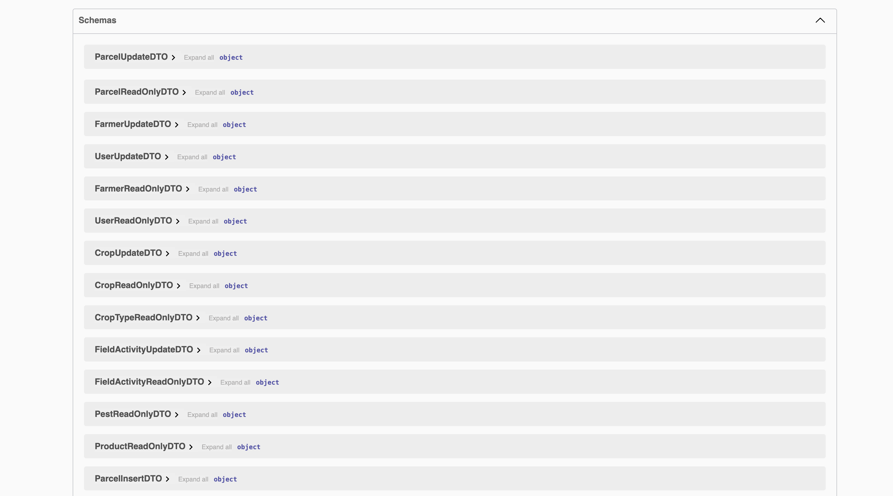
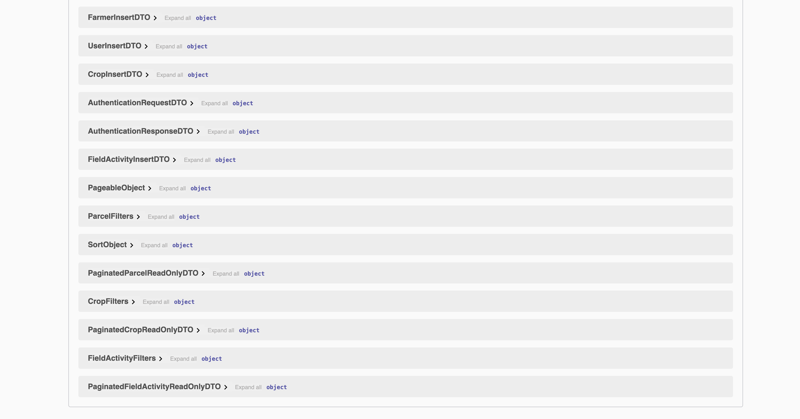

# AgriApp — Ψηφιακό Ημερολόγιο Αγρού

REST API για την τήρηση ημερολογίου καλλιεργητικών εργασιών σε καλλιέργειες
σιτηρών. Ο παραγωγός δηλώνει τα αγροτεμάχιά του και τις καλλιέργειες κάθε
περιόδου, και καταγράφει τις εργασίες που εκτελεί: ψεκασμούς, λιπάνσεις,
αρδεύσεις, παρατηρήσεις εχθρών και ασθενειών, και τη συγκομιδή.

Η εφαρμογή ψηφιοποιεί το ημερολόγιο φυτοπροστασίας που ο παραγωγός τηρεί
ούτως ή άλλως, και επιβάλλει αυτόματα κανόνες που στο χαρτί ελέγχονται με το
μάτι — κυρίως την τήρηση του χρόνου αναμονής πριν τη συγκομιδή.

Αποτελεί το back-end μέρος της τελικής εργασίας για το Coding Factory. Το
front-end υλοποιείται σε Angular και βρίσκεται σε ξεχωριστό repository.

## Τεχνολογίες

- Java 17 (Amazon Corretto)
- Spring Boot 3.5.4 — Web, Data JPA, Security, Validation
- MySQL 8
- JWT (jjwt 0.11.5)
- springdoc-openapi (Swagger UI)
- JUnit 5, H2, JaCoCo
- Gradle 8.14.5

## Στήσιμο

### Βάση δεδομένων

```sql
CREATE DATABASE agridb CHARACTER SET utf8mb4 COLLATE utf8mb4_0900_ai_ci;
CREATE USER 'agriuser'@'localhost' IDENTIFIED BY '<password>';
GRANT ALL PRIVILEGES ON agridb.* TO 'agriuser'@'localhost';
FLUSH PRIVILEGES;
```

Η collation είναι case-insensitive και accent-insensitive: «Ελιά», «ελια» και
«ΕΛΙΑ» θεωρούνται ίδια, ώστε οι αναζητήσεις να συμπεριφέρονται όπως περιμένει
ο χρήστης και τα `UNIQUE` constraints των καταλόγων να αποτρέπουν διπλοεγγραφές
που διαφέρουν μόνο σε τόνο ή πεζά.

Το σχήμα δημιουργείται από το Hibernate (`ddl-auto=update`) στην πρώτη
εκκίνηση.

### Αρχικά δεδομένα

Οι ρόλοι, τα δικαιώματα και οι τρεις παραμετρικοί κατάλογοι φορτώνονται από τα
scripts στο `src/main/resources/sql/`. Χωρίς αυτά **καμία εγγραφή χρήστη δεν
είναι δυνατή**, αφού το `users.role_id` είναι `NOT NULL`.

Στο `application-dev.properties` ξεσχολίασε τις τρεις γραμμές:

```properties
spring.sql.init.mode=always
spring.sql.init.data-locations=classpath:sql/roles_capabilities.sql,classpath:sql/regions.sql,classpath:sql/regional_units.sql,classpath:sql/crop_types.sql,classpath:sql/products.sql,classpath:sql/pests.sql
spring.jpa.defer-datasource-initialization=true
```

Τρέξε την εφαρμογή **μία φορά**, και ξανασχολίασέ τις. Τα scripts δεν είναι
idempotent και η επόμενη εκκίνηση θα αποτύχει με duplicate key. Το
`defer-datasource-initialization` είναι απαραίτητο ώστε να εκτελεστούν αφού το
Hibernate δημιουργήσει τους πίνακες.

### Μεταβλητές περιβάλλοντος

Δεν υπάρχουν credentials στο repository. Οι τιμές διαβάζονται από μεταβλητές
περιβάλλοντος με προεπιλογές ανάπτυξης:

| Μεταβλητή | Προεπιλογή |
|---|---|
| `MYSQL_HOST`, `MYSQL_PORT`, `MYSQL_DB` | `localhost`, `3306`, `agridb` |
| `MYSQL_USER`, `MYSQL_PASSWORD` | `agriuser`, μη λειτουργική τιμή |
| `JWT_SECRET` | κλειδί ανάπτυξης· **απαιτείται override εκτός localhost** |
| `JWT_EXPIRATION` | `10800000` (3 ώρες) |
| `ADMIN_USERNAME`, `ADMIN_PASSWORD`, `ADMIN_VAT` | κενές· χωρίς αυτές δεν δημιουργείται διαχειριστής |
| `app.cors.allowed-origins` | `http://localhost:4200` |

### Λογαριασμός διαχειριστή

Η εγγραφή μέσω του API δίνει πάντα ρόλο `FARMER`, οπότε ο πρώτος `ADMIN` δεν
μπορεί να προκύψει από αυτήν. Ο `AdminAccountInitializer` τον δημιουργεί στην
εκκίνηση, μία φορά, εφόσον δοθούν και οι τρεις μεταβλητές και ο χρήστης δεν
υπάρχει ήδη:

```bash
export ADMIN_USERNAME=admin@example.com
export ADMIN_PASSWORD='...'
export ADMIN_VAT=999999999
```

Έτσι κανένα συνθηματικό -- ούτε το hash του -- δεν μπαίνει στο repository. Αν οι
μεταβλητές λείπουν, η εφαρμογή ξεκινά κανονικά χωρίς διαχειριστή.

## Εκτέλεση

Ο Gradle wrapper περιλαμβάνεται στο repository, οπότε δεν χρειάζεται
εγκατεστημένο Gradle:

```bash
./gradlew bootRun
```

Εναλλακτικά, άνοιγμα του φακέλου στο IntelliJ IDEA ως Gradle project.

Το Gradle plugin του Spring Boot 3.5.4 υποστηρίζει Gradle 7.6.4+ ή 8.4+, όχι
9.x — γι' αυτό ο wrapper είναι καρφωμένος στο 8.14.5.

### Tests

```bash
./gradlew test
```

Τα tests τρέχουν σε in-memory H2 και δεν χρειάζονται MySQL. 82 tests σε 11
κλάσεις: unit tests στο service layer και integration tests που χτυπούν τα
endpoints μέσω `MockMvc`, με πραγματική αλυσίδα ασφαλείας και πραγματικά JWT.

Report καλύψεως στο `build/reports/jacoco/test/html/index.html` — 85% εντολών,
86% γραμμών. Το `lombok.config` βάζει `@lombok.Generated` στον κώδικα που
παράγει το Lombok, ώστε το ποσοστό να αφορά μόνο κώδικα γραμμένο στο χέρι.

### Logs

Το `logback-spring.xml` γράφει στην κονσόλα και σε `logs/all.log` και
`logs/error.log`, με ημερήσια εναλλαγή. Ένα φίλτρο βάζει στο MDC το username
και τη διεύθυνση IP κάθε αιτήματος, οπότε κάθε γραμμή δείχνει ποιος την
προκάλεσε. Ο φάκελος `logs/` δεν παρακολουθείται από το git.

## API

Τεκμηρίωση και διαδραστική δοκιμή:

```
http://localhost:8080/swagger-ui/index.html
```

Ροή: `POST /api/auth/authenticate` → αντιγραφή του `token` → κουμπί
**Authorize** → όλες οι υπόλοιπες κλήσεις.



Τα endpoints ομαδοποιημένα ανά controller:




Τα schemas των DTO παράγονται από τα records και τα annotations επικύρωσης:




| Method | Path | Απαιτεί |
|---|---|---|
| POST | `/api/farmers` | — (δημόσιο) |
| POST | `/api/auth/authenticate` | — (δημόσιο) |
| GET, PUT | `/api/farmers/me` | αυθεντικοποίηση |
| GET | `/api/farmers` | `MANAGE_USERS` |
| PATCH | `/api/farmers/{uuid}/status` | `MANAGE_USERS` |
| GET | `/api/lookups/{crop-types,products,pests,regional-units}` | αυθεντικοποίηση |
| GET | `/api/parcels`, `/api/crops`, `/api/activities` | `VIEW_REPORTS` |
| POST, PUT, DELETE | `/api/parcels`, `/api/crops` | `MANAGE_PARCELS` |
| POST, PUT, DELETE | `/api/activities` | `RECORD_ACTIVITIES` |

Οι λίστες υποστηρίζουν σελιδοποίηση, ταξινόμηση και φιλτράρισμα μέσω query
parameters, π.χ.

```
GET /api/parcels?page=0&pageSize=10&name=Κάτω&active=true&sortBy=name&sortDirection=DESC
```

## Δομή

```
gr.aueb.cf.agriapp
├── api               REST controllers
├── authentication    JwtService, AuthenticationService, CustomUserDetailsService
├── core
│   ├── enums         ActivityType, SeverityLevel, UnitOfMeasure, CropSeason, ...
│   ├── exceptions    ιεραρχία checked exceptions με κωδικό
│   ├── filters       GenericFilters, Paginated, φίλτρα ανά entity
│   ├── specifications δυναμικά κριτήρια αναζήτησης
│   ├── ErrorHandler  κεντρικός χειρισμός σφαλμάτων
│   ├── MDCLoggingFilter
│   └── OpenApiConfig
├── dto               Insert / Update / ReadOnly ανά entity
├── mapper            DTO <-> entity
├── model
│   ├── auth          Role, Capability
│   └── static_data   CropType, Product, Pest, Region, RegionalUnit
├── repository        Spring Data interfaces
├── security          SecurityConfiguration, JwtAuthenticationFilter, 401/403,
│                      AdminAccountInitializer
└── service           interface + υλοποίηση ανά entity
```

## Μοντέλο δεδομένων

Δεκατρείς πίνακες, σε δύο υποσυστήματα που τέμνονται στον `users`.

**Ασφάλεια:** `capabilities`, `roles`, `roles_capabilities`, `users`

**Domain:**

```
users 1─1 farmers 1─* parcels 1─* crops 1─* field_activities
```

**Παραμετρικοί:** `crop_types` (9 σιτηρά), `products` (13 σκευάσματα),
`pests` (13 εχθροί, ασθένειες και ζιζάνια), `regions` (13 περιφέρειες),
`regional_units` (74 περιφερειακές ενότητες)

Το σχήμα είναι σε BCNF. Οι αποκλίσεις που παραμένουν είναι συνειδητές και
τεκμηριώνονται παρακάτω.

## Κανόνες του domain

Επιβάλλονται στο service layer, όχι στα annotations των DTO, γιατί εξαρτώνται
από άλλες εγγραφές:

1. **Πληρότητα ανά τύπο εργασίας** — ο ψεκασμός απαιτεί σκεύασμα κατηγορίας
   φυτοπροστατευτικού, η λίπανση απαιτεί λίπασμα, η παρατήρηση απαιτεί εχθρό
   και ένταση προσβολής.
2. **Καμία εργασία μετά τη συγκομιδή**, και το πολύ μία συγκομιδή ανά
   καλλιέργεια.
3. **Τήρηση του χρόνου αναμονής.** Για κάθε ψεκασμό, η συγκομιδή δεν μπορεί να
   προηγείται της ημερομηνίας ψεκασμού συν τις ημέρες αναμονής του σκευάσματος.

Οι έλεγχοι εκτελούνται πάνω στο σύνολο των εγγραφών **όπως θα διαμορφωθεί μετά
την πράξη**, όχι μόνο στη νέα εγγραφή· διαφορετικά μια ενημέρωση που μεταφέρει
τη συγκομιδή νωρίτερα θα άφηνε προϋπάρχουσες εγγραφές σε άκυρη κατάσταση.

## Σχεδιαστικές αποφάσεις

**Ένας actor, με δικαιώματα σε δεδομένα και όχι σε κώδικα.** Η εφαρμογή έχει
μόνο αγρότες. Οι ρόλοι όμως δεν είναι enum αλλά entities, και κάθε ρόλος
συγκεντρώνει *capabilities* μέσω πίνακα συσχέτισης. Τα endpoints ελέγχουν
capability και όχι ρόλο, οπότε η αφαίρεση ενός δικαιώματος είναι εγγραφή στη
βάση και όχι αλλαγή κώδικα.

**Ο έλεγχος ιδιοκτησίας είναι ξεχωριστός από τα capabilities.** Το capability
απαντά «επιτρέπεται σε αυτόν τον χρήστη να καταγράφει εργασίες;». Δεν απαντά
«επιτρέπεται σε *αυτό* το χωράφι;». Το δεύτερο ελέγχεται στο service, μέσω της
αλυσίδας `field_activities → crops → parcels → farmers → users`. Η αίτηση για
συγκεκριμένη ξένη εγγραφή επιστρέφει 403· η λίστα απλώς δεν την περιλαμβάνει.

**Ό,τι καθορίζει πρόσβαση δεν έρχεται ποτέ από τον client.** Ο ρόλος, το
`isActive` της εγγραφής και ο ιδιοκτήτης ενός αγροτεμαχίου δεν υπάρχουν στα
DTO εισόδου — τα ορίζει το service από τον αυθεντικοποιημένο χρήστη.

**Κατάλογοι αντί για ελεύθερο κείμενο.** Το είδος καλλιέργειας, το σκεύασμα,
ο εχθρός και η τοποθεσία επιλέγονται από παραμετρικούς πίνακες. Χωρίς αυτό, η
ίδια καλλιέργεια θα καταγραφόταν ως «Σκληρό σιτάρι», «σκληρο σιταρι» και
«durum», και καμία ομαδοποίηση ή στατιστικό δεν θα ήταν αξιόπιστο. Ελεύθερο
κείμενο παραμένουν μόνο όσα είναι εξ ορισμού προσωπικά: η ονομασία του
χωραφιού, η ποικιλία και οι σημειώσεις.

Η τοποθεσία δηλώνεται σε επίπεδο **περιφερειακής ενότητας**: η περιφέρεια είναι
πολύ ευρεία για να εντοπίσει χωράφι, ο δήμος πολύ στενός για κατάλογο επιλογής.
Οι δύο πίνακες είναι χωριστοί ώστε το όνομα της περιφέρειας να μην
επαναλαμβάνεται σε κάθε ενότητα -- μια στήλη «περιφέρεια» δίπλα στο όνομα θα
εισήγαγε μεταβατική εξάρτηση και θα έσπαγε την BCNF.

Ο κατάλογος **δεν περιορίζει ποιες καλλιέργειες επιτρέπονται σε κάθε περιοχή**.
Η καταλληλότητα ενός σιτηρού είναι συνεχής μεταβλητή -- εξαρτάται από υψόμετρο,
έδαφος, άρδευση και ποικιλία -- όχι δυαδικός κανόνας ανά νομό. Ένας πίνακας
«τι επιτρέπεται πού» θα κωδικοποιούσε ψευδή διάκριση και θα εμπόδιζε τον
παραγωγό που δοκιμάζει κάτι νέο.

**Ο χρόνος αναμονής ανήκει στο σκεύασμα, όχι στην εργασία.** Είναι ιδιότητα
του φαρμάκου· αν τον πληκτρολογούσε ο χρήστης σε κάθε ψεκασμό, ο κανόνας θα
εξαρτιόταν από την ακρίβεια της πληκτρολόγησης.

**Ένας πίνακας για όλους τους τύπους εργασίας.** Το `field_activities` κρατά
ψεκασμούς, λιπάνσεις, αρδεύσεις, παρατηρήσεις και συγκομιδές, με τα άσχετα
πεδία `NULL`. Η εναλλακτική ήταν κληρονομικότητα με υποκλάση ανά τύπο —
καθαρότερη θεωρητικά, αλλά οι τύποι μοιράζονται τα περισσότερα πεδία και η
κύρια χρήση είναι η ενιαία χρονολογική ανάγνωση του ημερολογίου. Το κόστος
είναι ότι το σχήμα επιτρέπει άκυρους συνδυασμούς· τους αποκλείει ο κανόνας 1.

**Η ημερομηνία συγκομιδής δεν αποθηκεύεται.** Προκύπτει από την εργασία τύπου
`HARVEST`. Μια στήλη `harvest_date` στον `crops` θα ήταν δεύτερη πηγή αλήθειας
για το ίδιο γεγονός, με δυνατότητα να διαφωνήσουν.

**Λογική διαγραφή όπου υπάρχει ιστορικό.** Το αγροτεμάχιο απενεργοποιείται
αντί να διαγράφεται, γιατί κουβαλάει καλλιέργειες και εργασίες που πρέπει να
παραμένουν ανακτήσιμες. Η καλλιέργεια διαγράφεται πραγματικά, αλλά μόνο όσο
δεν έχει καμία εγγραφή στο ημερολόγιο.

**Ο διαχειριστής βλέπει και απενεργοποιεί, δεν δημιουργεί.** Ο ρόλος `ADMIN`
έχει `MANAGE_USERS` και `VIEW_REPORTS`, και δύο endpoints: το `GET
/api/farmers` για τη λίστα των εγγεγραμμένων αγροτών με σελιδοποίηση,
ταξινόμηση και φιλτράρισμα, και το `PATCH /api/farmers/{uuid}/status` για
λογική διαγραφή και επαναφορά λογαριασμού. Τα προσωπικά στοιχεία τα αλλάζει
μόνο ο ίδιος ο αγρότης από το `PUT /api/farmers/me`.

**Δεν δημιουργεί λογαριασμούς ο διαχειριστής**, γιατί το `POST /api/farmers`
είναι δημόσιο: ο αγρότης γράφεται μόνος του. Τα δύο μοντέλα -- δημόσια εγγραφή
και δημιουργία από διαχειριστή -- είναι εναλλακτικά, όχι συμπληρωματικά, και η
εφαρμογή διάλεξε το πρώτο.

**Η αποτυχία σύνδεσης δεν λέει ποτέ γιατί απέτυχε.** Λάθος συνθηματικό,
ανύπαρκτος χρήστης και απενεργοποιημένος λογαριασμός επιστρέφουν το ίδιο 401 με
το ίδιο μήνυμα. Ο έλεγχος `isEnabled()` του Spring Security προηγείται της
σύγκρισης του συνθηματικού, οπότε ένα ξεχωριστό μήνυμα θα επέτρεπε σε
οποιονδήποτε να μάθει την κατάσταση ενός λογαριασμού γνωρίζοντας μόνο το email.
Το κείμενο στο front-end παραπέμπει στον διαχειριστή, ώστε ο νόμιμος χρήστης να
μην ψάχνει τυπογραφικό λάθος που δεν υπάρχει.

**Η απενεργοποίηση σβήνει τη σύνδεση, όχι τα δεδομένα.** Το `PATCH` θέτει το
`is_active` σε `farmers` **και** σε `users`: το δεύτερο είναι αυτό που διαβάζει
το `isEnabled()` του `UserDetails`. Επειδή το JWT είναι stateless και ζει έως
τρεις ώρες, ο `JwtAuthenticationFilter` ελέγχει το `isEnabled()` σε κάθε
αίτημα -- αλλιώς ένας λογαριασμός που μόλις απενεργοποιήθηκε θα συνέχιζε να
δουλεύει μέχρι να λήξει το token του. Τα αγροτεμάχια, οι καλλιέργειες και οι
εργασίες παραμένουν στη βάση.

**Ο διαχειριστής δεν είναι αγρότης.** Δεν έχει εγγραφή στον πίνακα `farmers`,
οπότε τα endpoints των αγροτεμαχίων, των καλλιεργειών και του ημερολογίου δεν
έχουν νόημα γι' αυτόν: αν και του επιτρέπονται μέσω του `VIEW_REPORTS`, θα
επέστρεφαν `FarmerNotFound`. Το front-end εμφανίζει διαφορετικό μενού ανά ρόλο
ώστε να μη φτάνει ποτέ εκεί. Ο έλεγχος στο front-end γίνεται με βάση τον ρόλο
και αφορά μόνο τη δρομολόγηση· η εξουσιοδότηση επιβάλλεται στο back-end με βάση
τα capabilities.

## Γνωστοί περιορισμοί

**Οι χρόνοι αναμονής είναι ενδεικτικοί.** Οι τιμές του `products.sql` δεν
προέρχονται από εγκρίσεις κυκλοφορίας. Ο πραγματικός χρόνος αναμονής ορίζεται
ανά εμπορικό σκεύασμα **και** ανά καλλιέργεια στην έγκριση του ΥΠΑΑΤ. Υπάρχουν
ώστε ο έλεγχος να έχει ρεαλιστικά δεδομένα και **δεν αποτελούν γεωπονική
οδηγία**.

**Ο κατάλογος σκευασμάτων είναι σε επίπεδο δραστικής ουσίας**, όχι εμπορικού
σκευάσματος. Μια παραγωγική εφαρμογή θα τον τροφοδοτούσε από το επίσημο μητρώο
φυτοπροστατευτικών προϊόντων.

**Ο χρόνος αναμονής μοντελοποιείται ανά σκεύασμα.** Στην πραγματικότητα
εξαρτάται από το ζεύγος (σκεύασμα, καλλιέργεια), οπότε η πλήρης μοντελοποίηση
θα απαιτούσε πίνακα συσχέτισης `product_crop_intervals`. Η απλοποίηση
επιλέχθηκε συνειδητά, δεδομένου ότι ο κατάλογος είναι ήδη επιδεικτικός.

**Ο διαχειριστής δεν αλλάζει το συνθηματικό του από την εφαρμογή.** Το `PUT
/api/farmers/me` δουλεύει μόνο για αγρότες, γιατί εντοπίζει τον χρήστη μέσω
του πίνακα `farmers`. Η αλλαγή γίνεται σβήνοντας τη γραμμή του από τον `users`
και ξεκινώντας ξανά την εφαρμογή με νέο `ADMIN_PASSWORD`.
